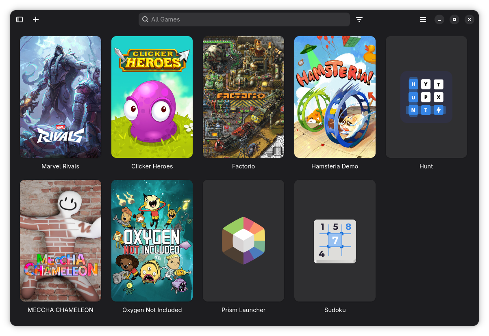
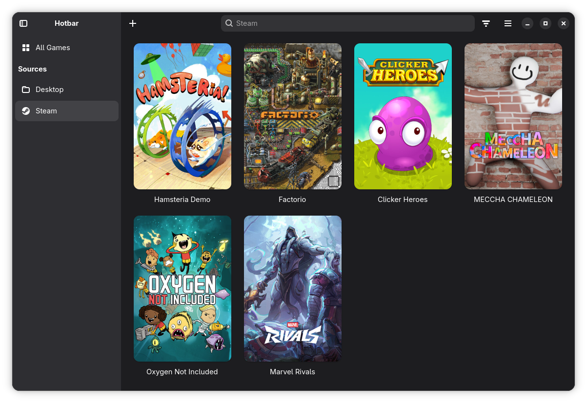
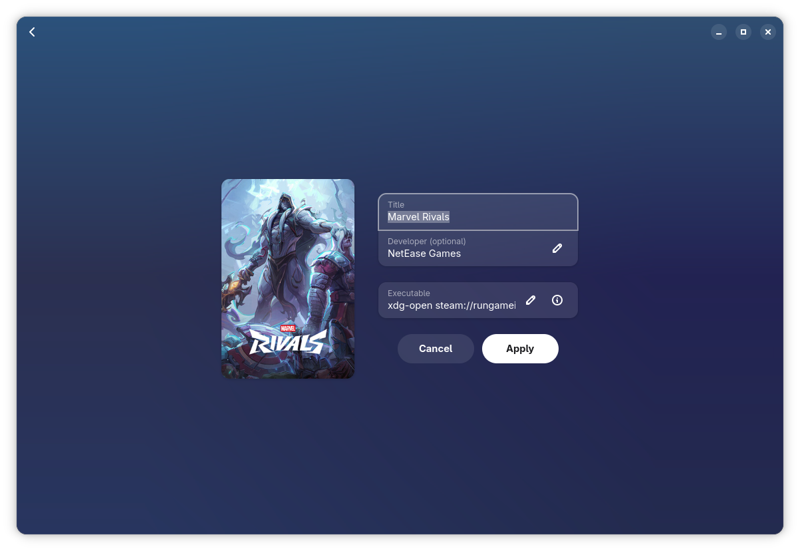

  
  <h1>Hotbar</h1>

Hotbar is a minimalistic Adwaita game launcher that brings all of your games together in one place. Games are imported automatically from:

- Steam
- Games installed as desktop apps
- Heroic, including Epic, GOG and Amazon games
- Lutris
- Legendary
- itch

You can also add your own games, hide the ones you don't want to see, and look any game up on sites like ProtonDB, PCGamingWiki and HowLongToBeat.

  
More screenshots

## Acknowledgements

Hotbar is a fork of [Cartridges](https://codeberg.org/kramo/cartridges) by kramo, licensed under [GPL-3.0-or-later](LICENSE).
The Steam source uses code from Solstice Game Studios’ [fork](https://github.com/solsticegamestudios/vdf) of vdf, licensed under [MIT](https://github.com/solsticegamestudios/vdf/blob/be1f7220238022f8b29fe747f0b643f280bfdb6e/LICENSE).
